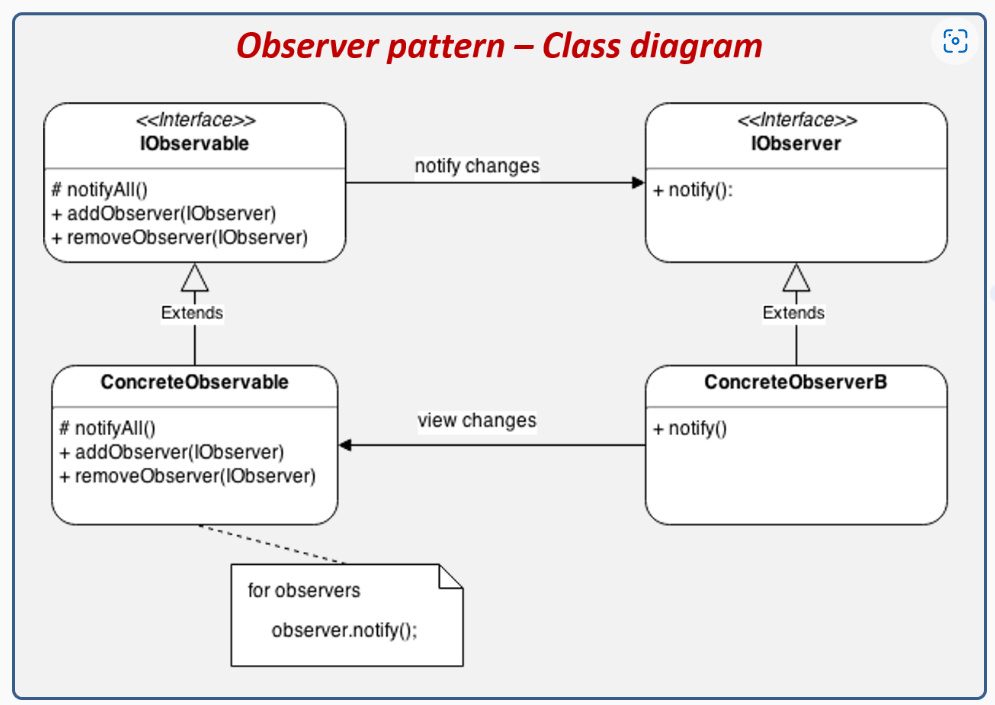
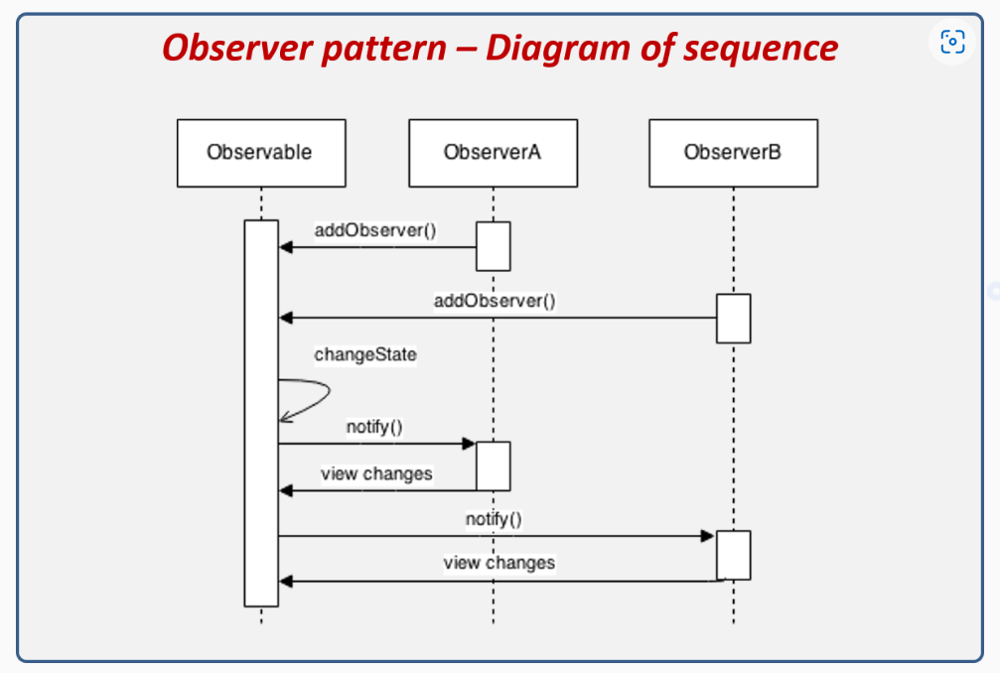
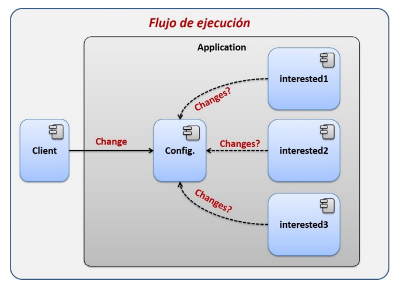
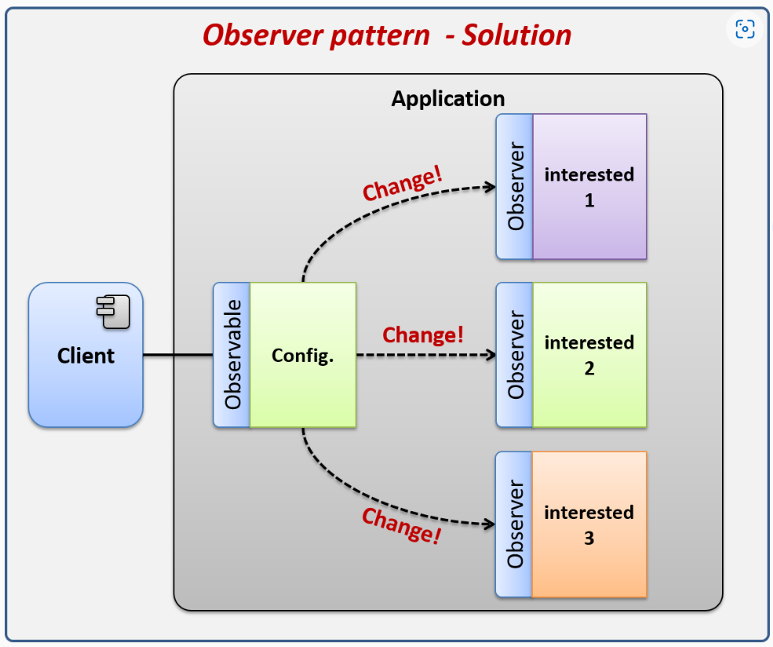
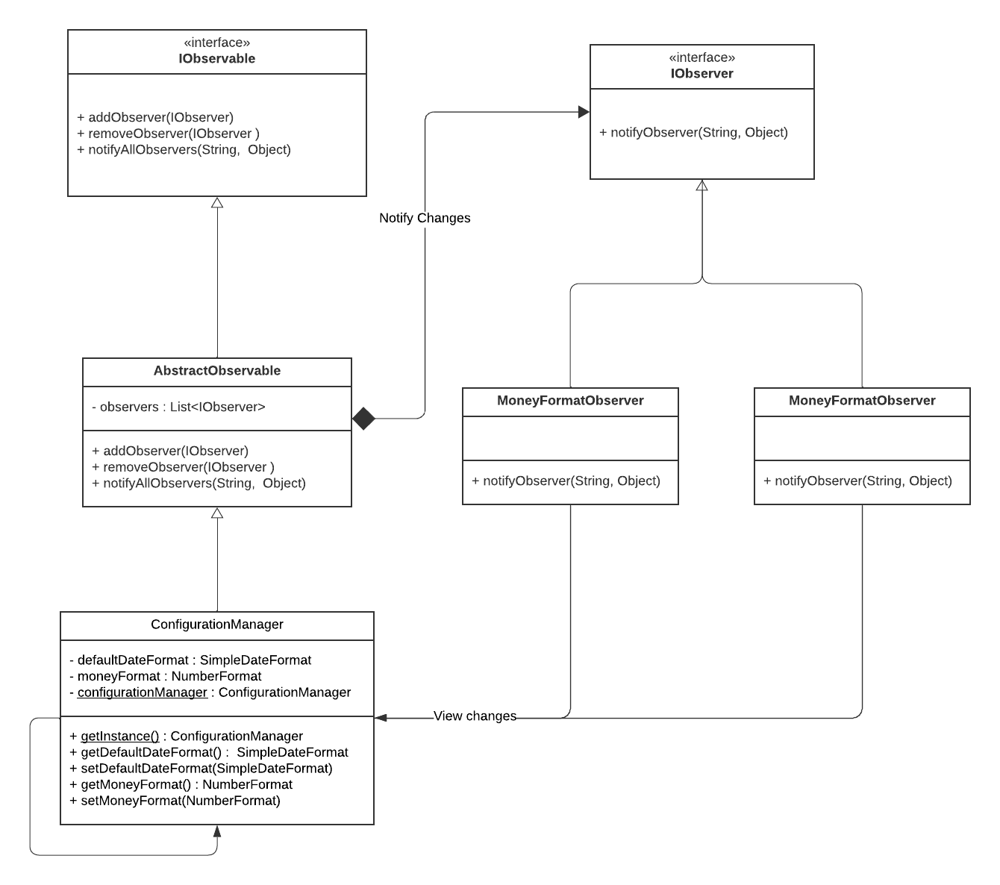

# Observer - Caso práctico

### Intención

Define una dependencia de un único objeto a muchos otros de tal manera que cuando el único objeto cambia su estado, todos los objetos dependientes son notificados y actualizados automáticamente.

### Clasificación

Patrón de Comportamiento

### Vista Estructural



### Vista Dinámica



### Ejemplo Real

Mediante la implementación del patrón de diseño Observer desarrollaremos una aplicación que cargue desde el inicio la configuración del sistema. Dicha configuración notificará de forma automática a todos los objetos que estén interesados en los cambios, todo esto con la finalidad de que los objetos interesados en la configuración no tengan que consultar cada momento si existe algún cambio importante para reflejarlo al usuario.

Solución, sin el patrón Observer:



Solución, con el patrón Observer:



### Ejecucion

```
gradle build
gradle run
```

## UML

